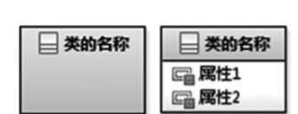

# 
 面向对象需求分析 

[TOC]

## 1. 领域模型

> 领域模型描述的内容与软件对象无关,是纯粹对现实客观世界的抽象描述.

领域模型中概念类及其关系的创建步骤:

### 1.1 识别或抽象出领域的概念类或对象

根据名词短语识别概念类

| 步骤  | 描述                                                         |
| ----- | ------------------------------------------------------------ |
| **1** | 自助式的分布式温控系统,可以让入住的**客户**根据自己的需求调节**房间**的**温度**及**风速** |
| **2** | 并且可以实时显示出**客房空调**消耗的能量所产生的**费用**     |
| **3** | 当客户退房时,**前台**可以出具空调的**使用详单**及**账单**    |
| **4** | 空调运行期间,**空调管理员**能够监控各房间空调的**使用状态**  |
| **5** | 此外,**酒店经理**在需要的情况下可以查看不同时间范围内的格式化**统计报表** |

根据分析得到概念类:

> 入住客户、酒店、客房、客房空调、前台、空调管理员、酒店经理、统计报表、使用详单、账单；

其他名词：

> 温度是客房这一概念类的属性，温度、风速、费用、使用状态是客房空调的属性；

### 1.2 建立概念类之间的关系

> 领域模型着重考虑“须知道”型“关联”。

通用关联列表

| 关联                           | 描述                                                         |
| ------------------------------ | ------------------------------------------------------------ |
| A在物理上是B的一部分           | 不适用                                                       |
| A在逻辑上是B的一部分           | 客房-酒店，客房空调-客房                                     |
| A是对B的描述                   | 不适用                                                       |
| A是交易或者报表B的一项         | 不适用                                                       |
| A是B的一个成员                 | 前台-酒店，酒店经理-酒店，空调管理员-酒店                    |
| A是B的一个组织子单元           | 不适用                                                       |
| A使用或管理B                   | 空调管理员-客房空调，入住客户-客房，入住客户-客房空调，酒店经理-统计报表，前台-详单，前台-账单 |
| A与B通信                       | 入住客户-前台                                                |
| A与一个交易B有关               | 入住客户-酒店                                                |
| A是一个与另一个交易B有关的事物 | 不适用                                                       |
| A与B相邻                       | 不适用                                                       |

以上概念类之间的关系

| 概念类              | 关系                                                   |
| ------------------- | ------------------------------------------------------ |
| 客房-酒店           | 组合                                                   |
| 客房空调-客房       | 组合                                                   |
| 前台-酒店           | 聚合                                                   |
| 空调管理员-酒店     | 聚合                                                   |
| 酒店经理-酒店       | 聚合                                                   |
| 空调管理员-客房空调 | 单向关联,可产生”监控表”关联类                          |
| 入住客户-客房       | 双向关联,可产生一个关联类”登记表”,来记录入住退房等信息 |
| 入住客户-客房空调   | 单向关联,可产生”使用信息表”关联类                      |
| 酒店经理-统计报表   | 单向关联                                               |
| 前台-详单           | 单向关联                                               |
| 前台-账单           | 单向关联                                               |
| 详单-账单           | 继承                                                   |
| 详单-统计报表       | 继承                                                   |

### 1.3 设置概念类的关键属性

> 对属性的建模主要包括属性名、类型名、可见性和初始值，在识别类的属性时，只需建模属性的名称、类型和初始值（若有），暂时不需考虑可见性。

酒店分布式温控系统用例相关概念的部分属性

| 概念       | 属性及其类型                                                 |
| ---------- | ------------------------------------------------------------ |
| 酒店       | 名称(string)...                                              |
| 入住客户   | 姓名(string)…                                                |
| 客房       | 房间号(number)、实时温度(int)…                               |
| 客房空调   | 当前温度(int)、目标温度(int)、风速(string)、模式(string)、费用(float)、使用状态(Boolean)、当前时间(date)、使用时长(int)… |
| 前台       | 前台人员姓名(string)…                                        |
| 空调管理员 | 姓名(string)…                                                |
| 酒店经理   | 姓名(string)…                                                |
| 使用详单   | 日期(date)、时段(string)、风速(string)、模式(string)、使用时长(int)、耗电量(int)、费用(float)… |
| 账单       | 日期(date)、耗电量(int)、费用(float)…                        |
| 统计报表   | 周次(int)、月次(int)、总费用(float)、总耗电量(float)…        |

### 1.4 领域模型图

### 1.5 注意事项

#### 1.5.1 构建领域模型时采用以下两种模式：

#### 1.5.2 概念类之间关系的表示：

* 依赖关系用带箭头的虚线；

* 关联关系用实线（带箭头）表示；

* 聚合关系用带空心菱形和箭头的直线表示；

* 组合关系用带实心菱形和箭头的直线表示；

* 关联类用虚线连接；

#### 1.5.3 属性应当优先定义为简单数据类型
## 2. 用例模型

### 2.1 用例图

### 2.2 用例描述

#### 2.2.1 前台用例描述

##### 2.2.1.1 出具详单用例描述

| 用例编号           | UC_1_1                                                       |
| ------------------ | ------------------------------------------------------------ |
| 用例名称           | 出具详单                                                     |
| 范围               | HM控制器                                                     |
| 级别               | 用例                                                         |
| 主要参与者         | 前台服务员                                                   |
| 项目相关人员及兴趣 | 前台服务员：登录系统后可以根据客户住房空调使用情况生成详单，传送给客户 |
| 前置条件           | 客户入住且使用空调                                           |
| 后置条件           | 客户退房并生成该次住宿的详单                                 |
| 主要成功场景       | 1. 客户请求出具详单                                          |
|                    | 2. 前台登录系统，根据客户房间号及入住时间段出具详单并打印    |
|                    | 3. 客户接收详单，用例结束                                    |
| 扩展（或替代流程） | *a 停电，等待来电                                            |
|                    | *b 系统故障，等待空调管理员修复                              |
| 发生频率           | 用户需求频率或前台主动查询频率                               |

##### 2.2.1.2 出具账单用例描述

| 用例编号             | UC_1_2                                                       |
| -------------------- | ------------------------------------------------------------ |
| 用例名称             | 出具账单                                                     |
| 范围                 | HM控制器                                                     |
| 级别                 | 用例                                                         |
| 主要参与者           | 前台服务员                                                   |
| 项目相关人员及其兴趣 | 前台服务员：登录系统后可以根据客户住房空调使用情况生成账单，传送给客户 |
| 前置条件             | 客户入住且使用空调                                           |
| 后置条件             | 客户退房并生成该次住宿的账单                                 |
| 主要成功场景         | 1. 客户请求出具账单                                          |
|                      | 2. 前台登录系统，根据客户房间号及退房时间出具本次消费的账单并打印账单 |
|                      | 3. 客户接收账单，用例结束                                    |
| 扩展（或替代流程）   | *a 停电，等待来电                                            |
|                      | *b 系统故障，等待空调管理员修复                              |
| 发生频率             | 用户需求频率或前台主动查询频率                               |

#### 2.2.2 酒店经理用例描述

##### 2.2.2.1 查看报表用例描述

| 用例编号             | UC_2_1                                                       |
| -------------------- | ------------------------------------------------------------ |
| 用例名称             | 查看报表                                                     |
| 范围                 | HM控制器                                                     |
| 级别                 | 用例                                                         |
| 主要参与者           | 酒店经理                                                     |
| 项目相关人员及其兴趣 | 酒店经理：在需要的情况下可以查看不同时间范围内的格式化统计报表 |
| 前置条件             | 数据库中有客户入住以及使用空调的退房记录                     |
| 后置条件             | 报表信息显示成功                                             |
| 主要成功场景         | 1. HM 在 HM 控制器中输入房间号清单并选择报表类型             |
|                      | 2. HM 根据提示设置时间范围                                   |
|                      | 3. HM 看到显示在 HM 控制器屏幕上的报表，用例结束             |
| 扩展（或替换流程）   | 1a 若提示房间号不存在则 HM 重新输入 / 取消操作               |
| 发生频率             | 酒店经理查看频率                                             |

##### 2.2.2.2 导出报表用例描述

| 用例编号             | UC_2_2                                                       |
| -------------------- | ------------------------------------------------------------ |
| 用例名称             | 导出报表                                                     |
| 范围                 | HM控制器                                                     |
| 级别                 | 用例                                                         |
| 主要参与者           | 酒店经理                                                     |
| 项目相关人员及其兴趣 | 酒店经理：在需要的情况下可以查看不同时间范围内的格式化统计报表 |
| 前置条件             | 数据库中有查看报表的记录                                     |
| 后置条件             | 格式化统计报表文件被导出                                     |
| 主要成功场景         | 1. HM 在 HM 控制器中输入报表号                               |
|                      | 2. HM 根据提示设置时间范围                                   |
|                      | 3. HM 看到导出的报表文件，用例结束                           |
| 扩展（或替换流程）   | 1a 若提示报表号不存在则 HM 重新输入 / 取消操作               |
| 发生频率             | 酒店经理导出频率                                             |

##### 2.2.2.3 设置时间范围用例描述

| 用例编号             | UC_2_3                                                       |
| -------------------- | ------------------------------------------------------------ |
| 用例名称             | 设置时间范围                                                 |
| 范围                 | HM服务对象                                                   |
| 级别                 | 子用例                                                       |
| 主要参与者           | 酒店经理                                                     |
| 项目相关人员及其兴趣 | 酒店经理：在需要的情况下可以查看不同时间范围内的格式化统计报表 |
| 前置条件             | HM 控制器根据条件成功搜索到相应报表                          |
| 后置条件             | 将设定时间范围内的报表输入到 HM 服务对象                     |
| 主要成功场景         | 1. HM 在 HM 控制器中输入房间号清单并选择报表类型             |
|                      | 2. HM 根据提示设置时间范围                                   |
|                      | 3. HM 输入完看到提示操作进行中                               |
| 扩展（或替换流程）   | 3a 若提示提示时间范围内查询结果为空则 HM 重新输入 / 取消操作 |
| 发生频率             | 查看或导出报表频率                                           |

#### 2.2.3 空调管理员用例描述

##### 2.2.3.1 查看空调状态用例描述

| 用例编号             | UC_3_1                                    |
| -------------------- | ----------------------------------------- |
| 用例名称             | 查看空调状态                              |
| 范围                 | HM控制器                                  |
| 级别                 | 用例                                      |
| 主要参与者           | 空调管理员                                |
| 项目相关人员及其兴趣 | 空调管理员：实时监控空调运行状态          |
| 前置条件             | 中央空调开启                              |
| 后置条件             | 成功显示各空调的运行状态                  |
| 主要成功场景         | 1. 确认中央空调开启                       |
|                      | 2. 在显示屏上显示空调的运行状态，用例结束 |
| 扩展（或替换流程）   | 1a 若中央空调未开启，提示先开启中央空调   |
| 发生频率             | 空调管理员操作频率                        |

#### 2.2.4 最终用户用例描述

##### 2.2.4.1 使用空调用例描述

| 用例编号             | UC_4_1                                       |
| -------------------- | -------------------------------------------- |
| 用例名称             | 使用空调                                     |
| 范围                 | 从机子系统                                   |
| 级别                 | 用例                                         |
| 主要参与者           | 最终用户                                     |
| 项目相关人员及其兴趣 | 最终用户：调节控制客房空调                   |
| 前置条件             | 主机被人工开启，从机也开机，用户操作控制面板 |
| 后置条件             | 用户操作完毕                                 |
| 主要成功场景         | 1. 用户请求使用空调                          |
|                      | 2. 用户调节温度，转扩展用例：调节温度 1_1    |
|                      | 3. 用户调节风速，转扩展用例：调节风速 1_2    |
|                      | 4. 用户查看账单，转扩展用例：查看账单 1_3    |
|                      | 5. 用户操作完毕，用例结束                    |
| 扩展（或替代流程）   | *a 停电，等待来电                            |
|                      | *b 系统故障，等待运维人员修复                |
| 特殊需求             | 控制面板简洁易操作                           |
| 技术与数据的变化列表 | 无                                           |
| 发生频率             | 用户操作频率                                 |
| 待解决的问题         | 无                                           |

##### 2.2.4.2 调节温度用例描述

| 用例编号             | UC_4_2                                                       |
| -------------------- | ------------------------------------------------------------ |
| 用例名称             | 调节温度                                                     |
| 范围                 | 从机子系统                                                   |
| 级别                 | 子用例                                                       |
| 主要参与者           | 最终用户                                                     |
| 项目相关人员及其兴趣 | 最终用户：成功获取设置的目标温度                             |
| 前置条件             | 主机被人工开启，从机也开机，用户操作控制面板                 |
| 后置条件             | 用户操作完毕，从机改变到请求温度                             |
| 主要成功场景         | 1. 用户按下温度调节按钮（提高、降低）                        |
|                      | 2. 控制面板显示调节后的目标温度                              |
|                      | 3. 重复步骤 1、2，直至用户按下确认按钮（需 3 秒内按下确认，超过 3 秒自动向主机传送请求） |
| 扩展（或替代流程）   | *a 停电，等待来电                                            |
|                      | *b 系统故障，等待运维人员修复                                |
| 特殊需求             | 控制面板简洁易操作                                           |
| 技术与数据的变化列表 | 无                                                           |
| 发生频率             | 用户操作频率                                                 |
| 待解决的问题         | 无                                                           |

##### 2.2.4.3 调节风速用例描述

| 用例编号             | UC_4_3                                                       |
| -------------------- | ------------------------------------------------------------ |
| 用例名称             | 调节风速                                                     |
| 范围                 | 从机子系统                                                   |
| 级别                 | 子用例                                                       |
| 主要参与者           | 最终用户                                                     |
| 项目相关人员及其兴趣 | 最终用户：成功在从控机上调节空调的风速                       |
| 前置条件             | 主机被人工开启，从机也开机，用户操作控制面板                 |
| 后置条件             | 用户操作完毕，从机风速设置为请求风速                         |
| 主要成功场景         | 1. 用户按下风速调节按钮（提高、降低）                        |
|                      | 2. 控制面板显示调节后的风速状态（高、中、低）                |
|                      | 3. 重复步骤 1、2，直至客户按下确认按钮（需 3 秒内按下确认，超过 3 秒自动向主机传送请求） |
| 扩展（或替代流程）   | *a 停电，等待来电                                            |
|                      | *b 系统故障，等待运维人员修复                                |
| 特殊需求             | 控制面板简洁易操作                                           |
| 技术与数据的变化列表 | 无                                                           |
| 发生频率             | 用户操作频率                                                 |
| 待解决的问题         | 无                                                           |

##### 2.2.4.4 查看账单用例描述

| 用例编号             | UC_4_4                                       |
| -------------------- | -------------------------------------------- |
| 用例名称             | 查看账单                                     |
| 范围                 | 从机子系统                                   |
| 级别                 | 子用例                                       |
| 主要参与者           | 最终用户                                     |
| 项目相关人员及其兴趣 | 最终用户：查看空调使用情况                   |
| 前置条件             | 主机被人工开启，从机也开机，用户操作控制面板 |
| 后置条件             | 用户操作完毕                                 |
| 主要成功场景         | 1. 用户操作控制面板                          |
|                      | 2. 用户查看账单                              |
|                      | 3. 控制面板显示结果，用户查看成功，用例结束  |
| 扩展（或替代流程）   | *a 停电，等待来电                            |
|                      | *b 系统故障，等待运维人员修复                |
| 特殊需求             | 面板显示的结果清晰明了并且无歧义             |
| 技术与数据的变化列表 | 无                                           |
| 发生频率             | 用户操作成功的频率                           |
| 待解决的问题         | 无                                           |

### 2.3 系统顺序图

#### 2.3.1 前台用例系统顺序图

##### 2.3.1.1 出具详单用例系统顺序图

##### 2.3.1.2 出具账单用例系统顺序图

#### 2.3.2 酒店经理用例系统顺序图

##### 2.3.2.1 查看报表用例系统顺序图

##### 2.3.2.2 导出报表用例系统顺序图

#### 2.3.3 空调管理员系统顺序图

##### 2.3.3.1 查看空调系统顺序图

#### 2.3.4 最终用户系统顺序图

##### 2.3.4.1 使用空调系统顺序图

##### 2.3.4.2 调节温度 & 调节风速系统顺序图

##### 2.3.4.3查看账单系统顺序图

### 2.4 操作契约

#### 2.4.1 前台用例操作契约

| 系统事件 | CreateRDP(RoomId, Date_In, Date_out)      |
| -------- | ----------------------------------------- |
| 交叉引用 | 出具详单                                  |
| 说明     | 前台根据房间号及入住的时间段出具详单      |
| 返回     | Return(list_RDR(Room_Ud, Requestime,...)) |
| 前置条件 | 客户退房请求出具详单                      |
| 后置条件 | 1. 服务对象被创建                         |
|          | 2. 详单对象被创建                         |
|          | 3. 详单所有属性被赋值                     |

| 系统事件 | PrintRDR(RoomId,List_RDR) |
| -------- | ------------------------- |
| 交叉引用 | 出具详单                  |
| 说明     | 打印详单,保存到文件       |
| 返回     | Return(isOK)              |
| 前置条件 | 前台完成详单的生成        |
| 后置条件 | 详单文件被创建            |

| 系统事件 | CreateInvoice(RoomId,Date_In,Date_out)    |
| -------- | ----------------------------------------- |
| 交叉引用 | 出具帐单                                  |
| 说明     | 前台根据房间号和退房时间出具本账单        |
| 返回     | Return(RoomId,Total_Fee,Date_In,Date_out) |
| 前置条件 | 客户退房请求出具账单                      |
| 后置条件 | 1. 服务对象被创建                         |
|          | 2. 账单对象被创建                         |
|          | 3. 账单所有属性被赋值                     |

| 系统事件 | PrintInvoice( RoomId,Date_In,Date_out) |
| -------- | -------------------------------------- |
| 交叉引用 | 出具帐单                               |
| 说明     | 前台根据房间号和退房时间出具本账单     |
| 返回     | Return(isOK)                           |
| 前置条件 | 前台完成账单的生成                     |
| 后置条件 | 账单文件被创建                         |

#### 2.4.2 酒店经理操作契约

| 系统事件 | ReportQuery(ID_Room_List,Type_Report)                        |
| -------- | ------------------------------------------------------------ |
| 交叉引用 | 查看报表                                                     |
| 说明     | **输入：**                                                   |
|          | 1. 要查看的房间号列表                                        |
|          | 2. 报表类型：日报、周报、月报、年报（默认为日报） 查看内容：每个房间空调使用和消费情况的（输出表格） |
|          | **查看内容：**                                               |
|          | 1. 房间号                                                    |
|          | 2. 空调开关次数                                              |
|          | 3. 温度调节次数                                              |
|          | 4. 风速调节次数                                              |
|          | 5. 被调度的次数                                              |
|          | 6. 空调使用总时长                                            |
|          | 7. 空调消耗总费用                                            |
|          | 8. 生成的帐单数                                              |
|          | 9. 生成的详单数                                              |
| 返回     | Return( ID_Room, Times_OnOff, Times_Change_Temp, Times_Change_WindSpeed, Times_Dispatch, Total_Time, Total_Fee, Number_of_Bill, Number_of_DR ) |
| 前置条件 | HM开始查看报表                                               |
| 后置条件 | 1. HM服务对象创建完成                                        |
|          | 2. 报表创建完成                                              |
|          | 3. 报表根据条件录入信息                                      |

| 系统事件 | ReportExport (ID_Report)                       |
| -------- | ---------------------------------------------- |
| 交叉引用 | 查看报表                                       |
| 说明     | 将报表内容格式化后导出到本地，保存便于离线查看 |
| 返回     | Return(isOK)                                   |
| 前置条件 | HM开始导出报表                                 |
| 后置条件 | 报表生成格式化统计文件                         |

| 系统事件 | ReportSet (Time_Frame)                          |
| -------- | ----------------------------------------------- |
| 交叉引用 | 设置时间范围                                    |
| 说明     | 1. 提示HM输入时间范围                           |
|          | 2. 将时间范围和HM控制器的输入一并传给HM服务对象 |
|          | 3. 将HM服务对象的返回内容传给HM控制器           |
| 返回     | HM服务对象的返回结果                            |
| 前置条件 | HM服务对象存在                                  |
| 后置条件 | HM服务对象返回结果被传入HM控制器                |

#### 2.4.3 空调管理员操作契约

| 系统事件 | GetTypes(RoomIDList)         |
| -------- | ---------------------------- |
| 交叉引用 | 查看空调状态                 |
| 说明     | 空调管理员实时监控各空调状态 |
| 返回     | return(TypeList)             |
| 前置条件 | 中央空调开启                 |
| 后置条件 | 1. 各空调创建完成            |
|          | 2. 状态信息赋值完成          |

#### 2.4.4 最终用户操作契约

| 系统事件 | BootAirConditioner()                 |
| -------- | ------------------------------------ |
| 交叉引用 | 客房空调                             |
| 前置条件 | 主机被人工启动，并正常送风           |
| 后置条件 | 客房空调开启，从机上线，并与主机联系 |

| 系统事件 | AdjustT()                                  |
| -------- | ------------------------------------------ |
| 交叉引用 | 客房空调                                   |
| 前置条件 | 主机启动，正常送风，从机正常开启，用户操作 |
| 后置条件 | 客房空调正常运行                           |

| 系统事件 | AdjustWind()                               |
| -------- | ------------------------------------------ |
| 交叉引用 | 客房空调                                   |
| 前置条件 | 主机启动，正常送风，从机正常开启，用户操作 |
| 后置条件 | 客房空调正常运行                           |

| 系统事件 | ShowBill()                                 |
| -------- | ------------------------------------------ |
| 交叉引用 | 客房空调                                   |
| 前置条件 | 主机启动，正常送风，从机正常开启，用户操作 |
| 后置条件 | 控制面板显示使用详情                       |

| 系统事件 | ChangeTemperature(RoomID, TargetTemp)                        |
| -------- | ------------------------------------------------------------ |
| 交叉引用 | 调节温度                                                     |
| 说明     | 客户调节温度                                                 |
| 返回     | Return(isOK)                                                 |
| 前置条件 | 从机出去开启状态                                             |
| 后置条件 | 1. 调度对象接收调节温度的请求，并与房间建立关联              |
|          | 2. 如果该请求的房间有服务对象，则调度对象与该服务对象建立关联，并将请求转发给服务对象 |
|          | 3. 如果该请求的房间在等待队列，则调度对象修改等待队列中的目标温度 |

| 系统事件 | DisplayTemperature(RoomID)   |
| -------- | ---------------------------- |
| 交叉引用 | 显示温度                     |
| 说明     | 从机显示客户调节温度输入信息 |
| 返回     | Return(isOK)                 |
| 前置条件 | 客户发出温度调节请求         |
| 后置条件 | 控制面板显示调节后的目标温度 |

| 系统事件 | ChangeWindSpeed(RoomID, WindSpeed)                           |
| -------- | ------------------------------------------------------------ |
| 交叉引用 | 调节风速                                                     |
| 说明     | 客户调节风速                                                 |
| 返回     | Return(isOK)                                                 |
| 前置条件 | 从控机处于开启状态                                           |
| 后置条件 | 1. 调度对象接收调节风速的请求，并与房间建立关联              |
|          | 2. 如果该请求的房间有服务对象，则调度对象与该服务对象建立关联，并将请求转发给服务对象 |
|          | 3. 如果该请求的房间在等待队列，则调度对象修改等待队列中的目标风速 |

| 系统事件 | DisplayWindSpeed(RoomID)     |
| -------- | ---------------------------- |
| 交叉引用 | 显示风速                     |
| 说明     | 从机显示客户调节风速输入信息 |
| 返回     | Return(isOK)                 |
| 前置条件 | 客户发出温度调节请求         |
| 后置条件 | 控制面板显示调节后的目标风速 |

| 系统事件 | ShowBillList()                             |
| -------- | ------------------------------------------ |
| 交叉引用 | 客房空调                                   |
| 前置条件 | 主机启动，正常送风，从机正常开启，用户操作 |
| 后置条件 | 控制面板显示使用详情                       |
