# 面向对象设计

[TOC]

## 1. 动态结构设计

> 系统架构：基于 B/S 的分层架构

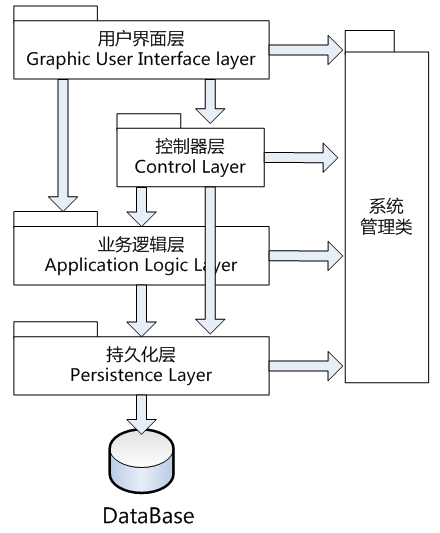

### 1.1 主要用例：前台

>  控制器：外观控制器-Server

#### 1.1.1 创建详单

| 对象设计          | CreateRDR(RoomID,date_in,date_out)                           |
| ----------------- | ------------------------------------------------------------ |
| 操作契约-后置条件 | 1. 详单对象被创建（创建一个RDR实例R)                         |
|                   | 2. 详单的所有属性被赋值（属性修改）                          |
| 设计用例实现过程  | 1. Server作为外观控制器接收系统事件CreateRDR                 |
|                   | 2. 根据操作契约，创建一个RDR实例R，Server具有创建R的职责     |
|                   | 3. 给详单所有属性赋值：根据当前服务对象的请求找到对应的房间空调使用详情，并显示 |

> 序列图：

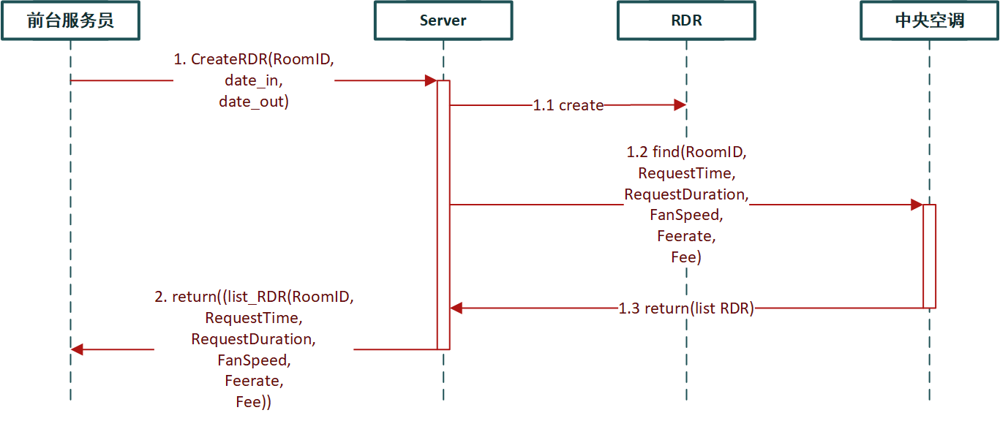

#### 1.1.2 打印详单

| 对象设计          | PrintRDR(RoomID, list RDR)                    |
| ----------------- | --------------------------------------------- |
| 操作契约-后置条件 | 1. 详单文件被创建                             |
| 设计用例实现过程  | 1. Server作为控制器接收系统事件PrintRDR       |
|                   | 2. 根据操作契约，找到对应的详单文件，打印出来 |

> 序列图：

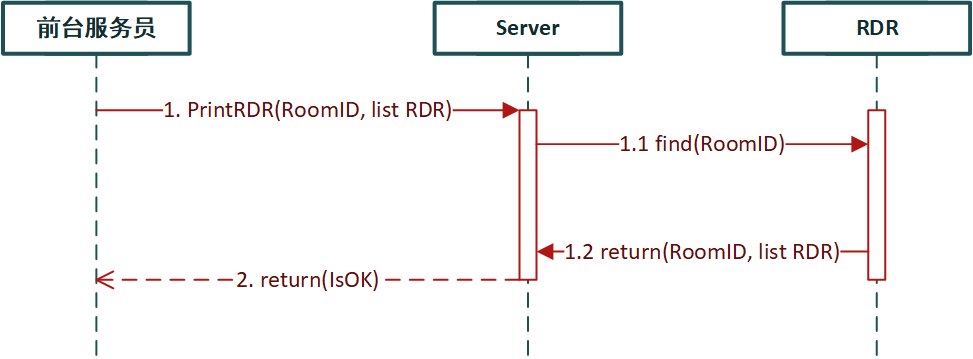

#### 1.1.3 创建账单

| 对象设计          | CreateInvoice()                                              |
| ----------------- | ------------------------------------------------------------ |
| 操作契约-后置条件 | 1. 账单对象被创建（创建一个Invoice实例I）                    |
|                   | 2. 账单对象的所有属性被赋值（属性修改）                      |
| 设计用例实现过程  | 1. 外观控制器Server接收系统事件CreateInvoice                 |
|                   | 2. 根据操作契约创建一个Invoice实例I，Server具有创建I的职责   |
|                   | 3. 给账单所有属性赋值：根据当前服务对象的请求找到对应的房间使用情况，并显示 |

> 序列图：

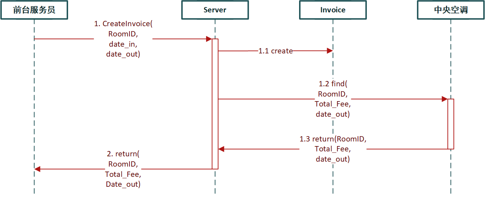

#### 1.1.4 打印账单

| 对象设计          | PrintInvoice(RoomID)                                         |
| ----------------- | ------------------------------------------------------------ |
| 操作契约-后置条件 | 1. 账单文件被创建                                            |
| 设计用例实现过程  | 1. 外观控制器Server接收系统事件PrintInvoice                  |
|                   | 2. 根据操作契约，账单文件被创建，即将对应要求的账单作为文件输出打印 |

> 序列图：

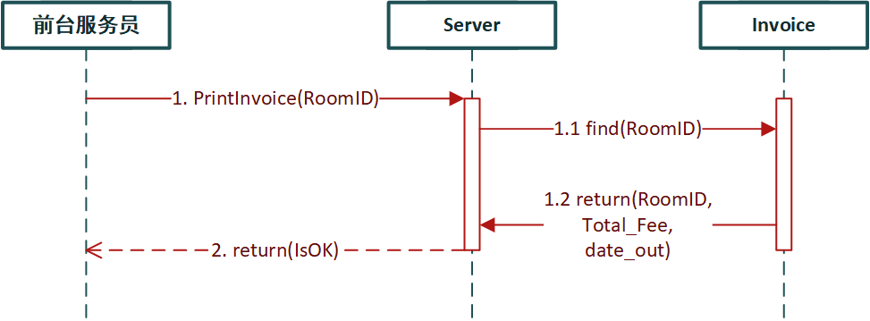

### 1.2 主要用例：酒店经理

> 控制器：外观控制器-Server

#### 1.2.1 查看报表

| 对象设计          | ReportQuery(ID_Room_List,Time_Frame,Type_Report=daily) |
| ----------------- | ------------------------------------------------------ |
| 操作契约-后置条件 | 1. 创建统计对象实例（实例创建）                        |
|                   | 2. 统计对象和Server建立关联（关联形成）                |
|                   | 3. 初始化统计对象的属性（属性修改）                    |
|                   | 4. 创建报表实例（实例创建）                            |
|                   | 5. 报表和统计对象建立关联（关联形成）                  |
|                   | 6. 修改报实例的属性（属性修改）                        |
| 设计用例实现过程  | 1. 外观控制器Server接收系统事件ReportQuery             |
|                   | 2. 报表实例被创建，并修改其属性                        |
|                   | 3. 返回报表信息                                        |

> 序列图：

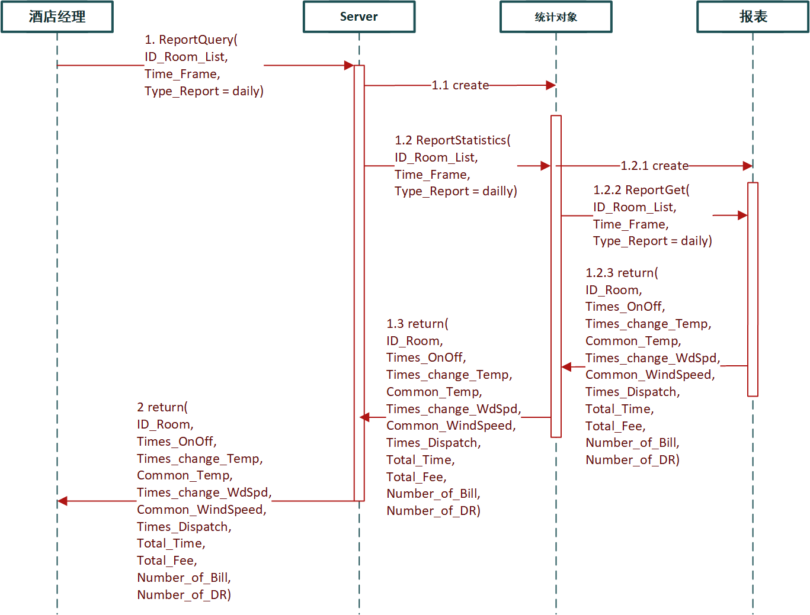

#### 1.2.2 导出报表

| 对象设计          | ReportExport(ID_Report, Time_Frame)               |
| ----------------- | ------------------------------------------------- |
| 操作契约-后置条件 | 1. 生成格式化统计报表文件                         |
| 设计用例实现过程  | 1. 外观控制器Server接收系统事件ReportExport       |
|                   | 2. 统计对象检查报表统计记录                       |
|                   | 3. 根据检查到的报表统计记录生成格式化统计报表文件 |

> 序列图：

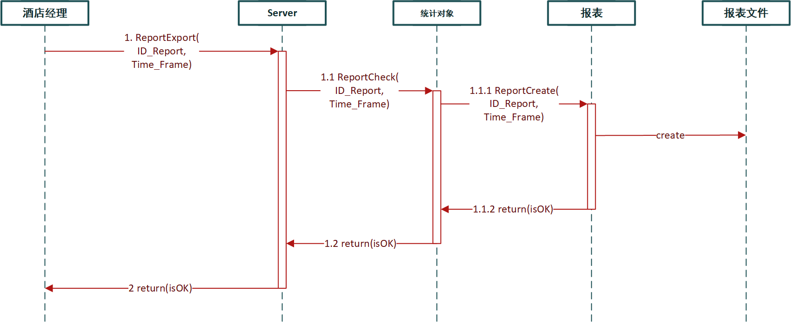

### 1.3 主要用例：空调管理员

> 控制器：外观控制器-Server

#### 1.3.1 创建空调

| 对象设计          | makeAirConditioner()                                         |
| ----------------- | ------------------------------------------------------------ |
| 操作契约-后置条件 | 1. 创建空调实例a                                             |
|                   | 2. a 和 Server建立关联                                       |
|                   | 3. 初始化 a 的属性，空调模式、温度范围、缺省温度、费率和房间号 |
| 设计用例实现过程  | 1. 外观控制器Server接收系统事件makeAirConditioner            |
|                   | 2. 根据操作契约，创建一些列AirConditioner实例a，Server具有创建a的职责 |
|                   | 3. AirConditioner与Server形成缺省的关联关系                  |
|                   | 4. 初始化a，使得该实例能记录空调模式、温度范围、缺省温度、费率和房间号 |

> 序列图：

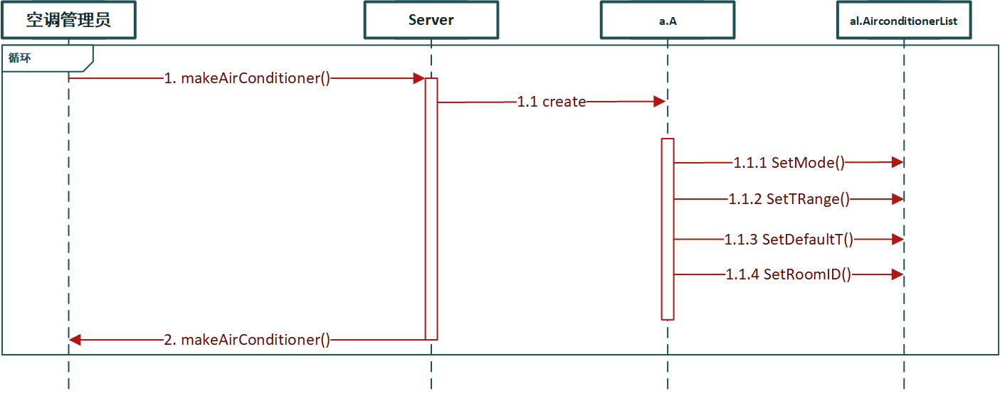

#### 1.3.2 查询监控

| 对象设计          | GetType(RoomIDList)                                      |
| ----------------- | -------------------------------------------------------- |
| 操作契约-后置条件 | 1. 系统管理员与clock建立关联，若满一分钟则查询，否则等待 |
| 设计用例实现过程  | 1. 外观控制器Server接收系统事件GetType                   |
|                   | 2. clock与Server建立关联                                 |
|                   | 3. 获取AirConditioner的状态信息等                        |

> 序列图：

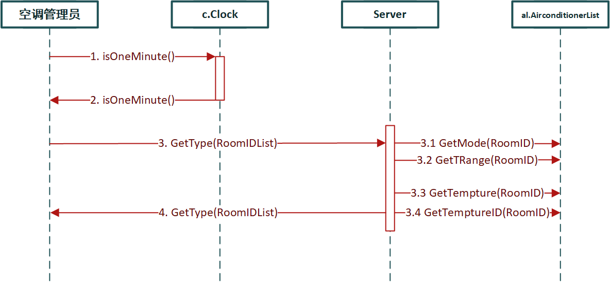

### 1.4 主要用例：最终用户

> 控制器：外观控制器-Server

#### 1.4.1 启动空调

| 对象设计          | BootAirConditioner(RoomID)                                   |
| ----------------- | ------------------------------------------------------------ |
| 操作契约-后置条件 | 1. Service服务对象创建一个ServiceItem实例si                  |
|                   | 2. 初始化sli的属性                                           |
|                   | 3. sli添加到ServiceLine或WaitLine队列中                      |
| 设计用例实现过程  | 1. 外观控制器Server接收事件BootAirConditioner                |
|                   | 2. 资源管理对象判断当前服务队列ServiceLine是否有资源，并告知Service服务对象 |
|                   | 3. Service服务对象负责创建新的ServiceLineItem实例sli并初始化 |
|                   | 4. Service根据当前资源使用情况将新的实例sli添加到ServiceLine或WaitLine队列中 |

> 序列图如下：

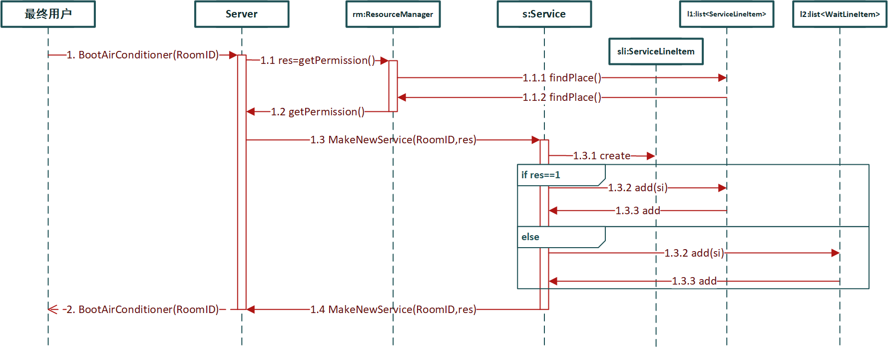

#### 1.4.2 更改温度&风速&模式

| 对象设计          | ChangeInfo(RoomID,targetTemp,targetWindSpeed,mode)           |
| ----------------- | ------------------------------------------------------------ |
| 操作契约-后置条件 | 1. 对应房间的ServiceItem实例sli的属性改变                    |
| 设计用例实现过程  | 1. 外观控制器Server接收系统事件ChangeWindAndTemp             |
|                   | 2. ResourceManager对象根据目标房间ID从ServiceLine和WaitLine中取出对应实例sli |
|                   | 3. ResourceManager对象修改实例sli的目标温度、目标风速或模式  |
|                   | 4. ResourceManager对象根据调度规则将更改后的实例sli插入到ServiceLine或WaitLine队列中 |

> 序列图如下：

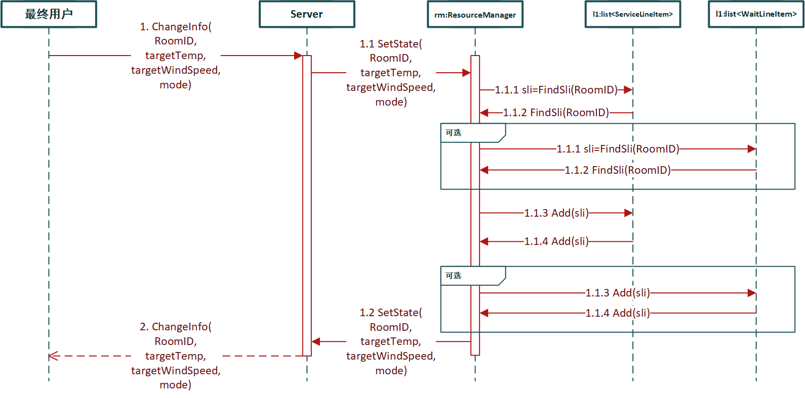

#### 1.4.3 查看账单

| 对象设计          | ShowBill(RoomID)                                             |
| ----------------- | ------------------------------------------------------------ |
| 操作契约-后置条件 | 1. 获取对应房间ID的空调使用及消费情况                        |
| 设计用例实现过程  | 1. 外观控制器Server接收系统事件ShowBill                      |
|                   | 2. Accountant对象根据目标房间ID在ServiceLine队列中找到实例sli |
|                   | 3. 返回该实例的信息                                          |

> 序列图如下：

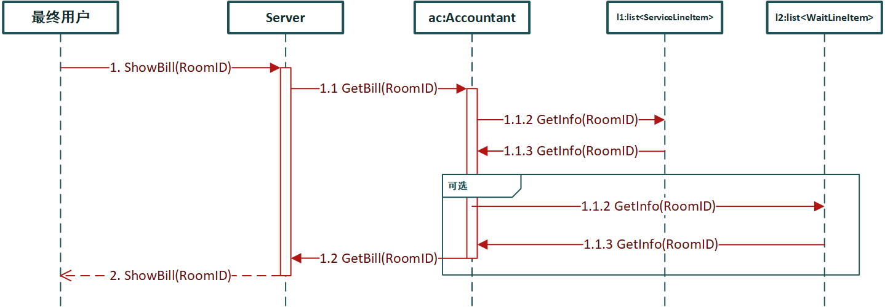

#### 1.4.4 关闭空调

| 对象实例          | AirConditionerOff(RoomID)                         |
| ----------------- | ------------------------------------------------- |
| 操作契约-后置条件 | 1. 房间的服务实例从队列中移除                     |
| 设计用例实现过程  | 1. 外观控制器Server接收系统事件AirConditionerOff  |
|                   | 2. ResourceManager找到对应的实例sli并从队列中移除 |

> 序列图：

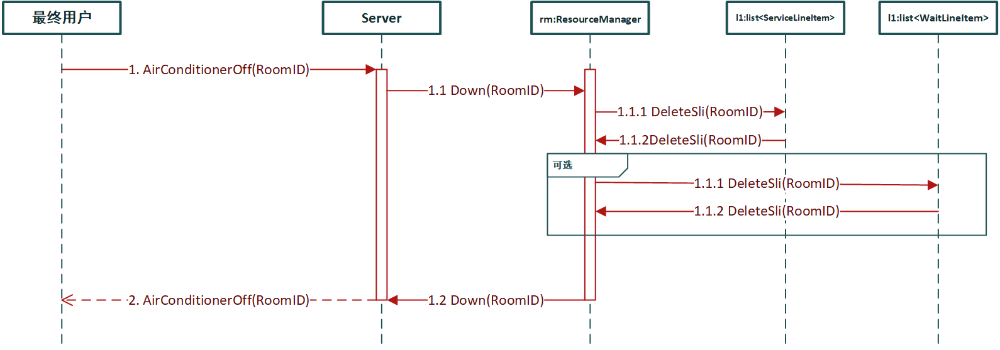

## 2. 静态结构设计

系统设计类图如下：

| 方法名             | 方法说明                          |
| ------------------ | --------------------------------- |
| InitRM()           | 初始化ResourceManager             |
| InitACA()          | 初始化AirConditionerAdministrator |
| InitInvoice()      | 初始化Invoice                     |
| InitDetailRecord() | 初始化DetailRecord                |
| InitHMStat()       | 初始化HMStatistical               |
| InitHMReport()     | 初始化HMReport                    |
| InitReception()    | 初始化Reception                   |
| InitLine()         | 初始化服务队列和等待队列          |
| On()               | 开机                              |
| Down()             | 关机                              |

### 2.1 前台

#### 2.1.1 DetailRecord

| 属性名                | 属性说明             |
| --------------------- | -------------------- |
| RoomID: int           | 当期请求服务的房间ID |
| time                  | 请求发出的时间       |
| RequestDuration: time | 请求响应时间         |
| FanSpeed: int         | 风速                 |
| FeeRate: float        | 利率                 |
| Fee: float            | 费用                 |

| 方法名                       | 方法说明                 |
| ---------------------------- | ------------------------ |
| Create()                     | 创建DetailRecord实例对象 |
| PrintRDR(RoomId,list_RDR( )) | 打印出详单,存为文件形式  |

#### 2.1.2 Invoice

| 属性名          | 属性说明             |
| --------------- | -------------------- |
| RoomID:int      | 当期请求服务的房间ID |
| Total_Fee:Float | 该服务对象的总费用   |
| Date_Out:date   | 该服务对象退房日期   |

| 方法名           | 方法说明                |
| ---------------- | ----------------------- |
| Create()         | 创建Invoice实例对象     |
| PrintRDR(RoomId) | 打印出账单,存为文件形式 |

### 2.2 酒店经理

#### 2.2.1 HM_Statistical

| 属性名              | 属性说明                                       |
| ------------------- | ---------------------------------------------- |
| ID_Room_List: list  | 要查看的房间号列表                             |
| Time_Frame: date    | 时间范围                                       |
| Type_Report: string | 报表类型：日报、周报、月报、年报（默认为日报） |
| ID_Report: string   | 报表号                                         |

| 方法名             | 方法说明                         |
| ------------------ | -------------------------------- |
| ReportStatistics() | 创建报表实例, 修改报表实例的属性 |
| ReportCheck(HM_r)  | 检查报表统计记录                 |

#### 2.2.2 HM_Report

| 属性名              | 属性说明                                       |
| ------------------- | ---------------------------------------------- |
| ID_Room_List: list  | 要查看的房间号列表                             |
| Time_Frame: date    | 时间范围                                       |
| Type_Report: string | 报表类型：日报、周报、月报、年报（默认为日报） |
| ID_Report: string   | 报表号                                         |

| 方法名         | 方法说明               |
| -------------- | ---------------------- |
| ReportGet()    | 返回报表信息           |
| ReportCreate() | 生成格式化统计报表文件 |

### 2.3 最终用户 & 空调管理员

#### 2.4.1 ResourceManager

| 方法名                                | 方法说明                                            |
| ------------------------------------- | --------------------------------------------------- |
| ChangeTemperature(RoomID, TargetTemp) | 更改房间号 RoomID 对应的服务对象的温度为 TargetTemp |
| ChangeWindSpeed(RoomID, WindSpeed)    | 更改房间号 RoomID 对应的服务对象的风速为 WindSpeed  |
| ShowBillList(RoomID)                  | 显示房间的费用信息                                  |
| Add(Service, line)                    | 将服务 Service 加入队列line                         |
| Delete(ServiceID, line)               | 将服务号 ServiceID 对应的服务从队列 line 中删除     |
| Find(RoomID, line)                    | 在队列 line 中寻找 RoomID 对应的服务                |

#### 2.4.2 AirConditionerAdministrator

| 属性名                  | 属性说明         |
| ----------------------- | ---------------- |
| num_running_ac: int     | 当前运行的空调数 |
| num_of_all_ac: int      | 空调总数         |
| ids_of_running_ac: list | 运行空调编号列表 |

| 方法名                  | 方法说明                            |
| ----------------------- | ----------------------------------- |
| Add(service, line)      | 将新创建的服务 service 加入队列line |
| Delete(ServiceID, line) | 将关闭的服务从队列 line 中删除      |
| GetACState()            | 获取空调运行状态信息                |
| sendMessageToDBFcade()  | 传递空调信息到持久化实例            |

#### 2.4.3 AirConditioner

| 属性名                               | 属性说明                    |
| ------------------------------------ | --------------------------- |
| On: boolean = false                  | 空调开启状态                |
| RoomID: int                          | 当前请求服务的房间ID        |
| ServiceID: int                       | 请求服务的ID                |
| WindSpeed: int                       | 当前风速                    |
| temperature: int                     | 当前温度                    |
| mode: int = 0                        | 制冷\制热模式，0为冷，1为热 |
| runtime: time                        | 运行时间                    |
| fee: float                           | 当前费用                    |
| range_of_temperature: list = [18,25] | 温度范围                    |
| runnint_time_speed_1: list = []      | 以1档风速运行的起止时间段   |
| runnint_time_speed_2: list = []      | 以2档风速运行的起止时间段   |
| runnint_time_speed_2: list = []      | 以3档风速运行的起止时间段   |

